### Story of an organization and Problem introduction

* _**Organization name**_ : Contoso
* _**Application**_ : ecommerce
* _**Architecture**_ :

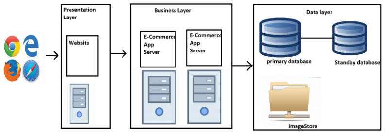

* _**Problems**_ :
    
 1. Different front-ends ( ios, Andriod )
    + Accesibility
    + Cross platform

  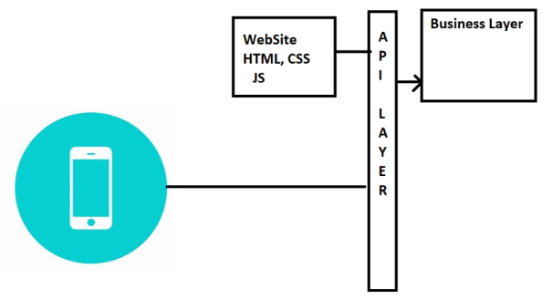

 2. Deployment of new features : typically are having more downtimes
    + Zero down time deployments
    + Faster deployments
 3. Contoso wants to run this application on any cloud or on-premises
    + Portability
 4. De Composing application into smaller services according to the business needs

 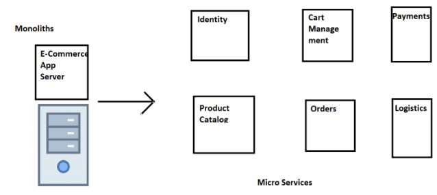

 5. Updating any microservice can be done independently
 6. Re using microservices is much easier
    + Scaling for microservice is much easier and cheaper compared to Scaling monolith

* _**Solution**_ :

 1. Container Technology ( _**Docker**_ )
 2. Container Orchestration ( _**Kubernetes**_ )

#### Application Deployments - Terms

 1. _**Capex (Capital Expenditure)**_ : Investment made by organisation for purchasing of servers 
 2. _**Opex (Operational Expenditure)**_ : Investment made by organisation to maintain servers
 3. _**Physical Server**_ : Racks have servers where we can directly install an application
 4. _**Hypervisor**_ : Software used to create virtual machines. They are of two types : `ONE`, which can be installed directly on servers and create virtual machines. `TWO`, where we install over the OS and then create virtual machines.
 5. _**Virtual Machine**_ : Isolated space to virtually create hardware and run applications individually
 6. _**Return on Investment (ROI)**_ : How much returns or results achieved in order to create hardware and running applications efficiently

### Evolution

1. _**Generation 1**_ : 

    * Directly run on physical servers
    * If your application is not utilizing hardware completely, ROI is very long
    
    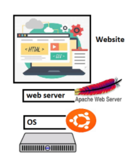

2. _**Generation 2**_ : 
    
    * Hypervisors create virtual machines and applications installed in virtual machines
    * Hypervisors perform hardware virtualization and provide
      + virtual cpu
      + virtual ram
      + virtual disk
      + virtual network
    * In the isolated area created by hypervisor, we can install OS and necessary softwares
    * Application can be installed and used from here and also have better ROI

    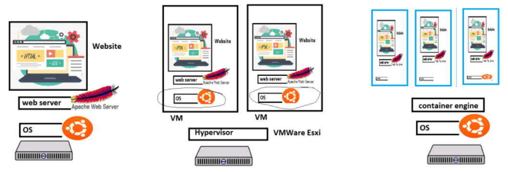

3. _**Generation 3**_ - _**Containers**_ : 

    * These are isolated areas which look like vms but the container is an isolated area which has virtualized OS
    * Applications running in Containers will not feel the difference
    * We can run more applications on a single box

    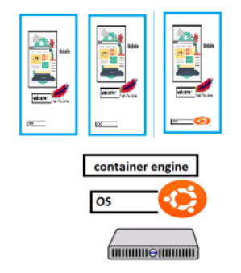

### What is Docker ?

* _**Docker (Dock worker)**_ is used to create containers which is standard way of packaging any application
* Application can be any of the below but have a standard way of packaging i.e _**Docker image**_.
    + developed in any technology
    + developed on any server
* Packaging in docker image format helps us to run our application everywhere possible

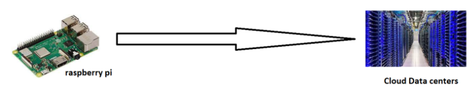

#### Expectations in terms of docker from you

* Containerize any application run by your organization
* Manage Data, Security and Networks for containerized applications
* To acheive the above, we need to use :
    + Docker and understand how it runs and creates containers
    + play with docker aroud networks, data and security
    + apply them to our application

#### Run apache server and nginx (VM)

* Create a VM (Ubuntu) and ssh into it
```
sudo apt update
sudo apt install apache2 -y
```
* Now navigate to `http://<public-ipaddress>`

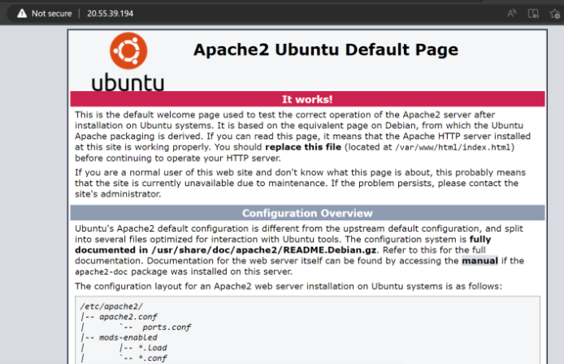

* Now let's try to also install nginx and navigate to `http://<public-ipaddress>`
```
sudo apt update
sudo apt install nginx -y
```
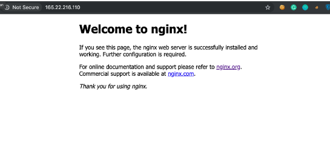

### Docker Installation

* When we install docker we get two major components :

 1.  _**Docker client**_ : A command line to interact with docker engine

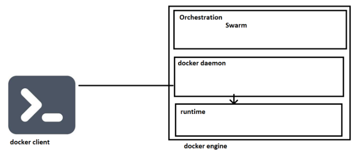

 2. _**Docker engine**_ : This is collection of multiple components
        * Orchestration
        * Docker daemon
        * Runtime
* to play with docker commands
    * manual --help
    * cheatsheet

#### Installations

 1. _**Linux VM**_:

    * Create a VM with standard configuration
    ```
    sudo cat /etc/group
    sudo cat /etc/passwd
    ```
* Docker can be installed in many ways :  

 +  Using following instructions
        
    [ Refer Here : https://docs.docker.com/engine/install/ ]

 + Script based installation 
        
    [ Refer Here : https://get.docker.com/ ]

```
curl -fsSL https://get.docker.com -o get-docker.sh
sh get-docker.sh
docker info
```
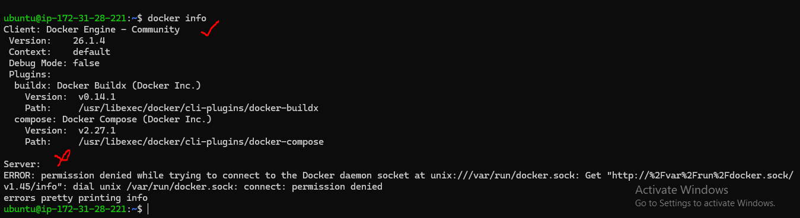

* Docker allows communication to the unix socket for the users who belong to docker group `sudo cat /etc/group`
* So let's add current user `ubuntu (whoami)` to docker group `sudo usermod -aG <groupname> <username>` _**sudo usermod -aG docker ubuntu**_
* Then exit and relogin `docker info`

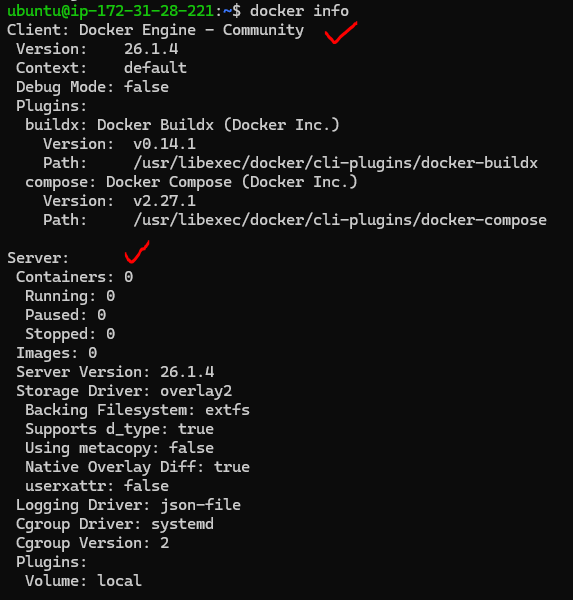

* Now execute `docker container run hello-world`

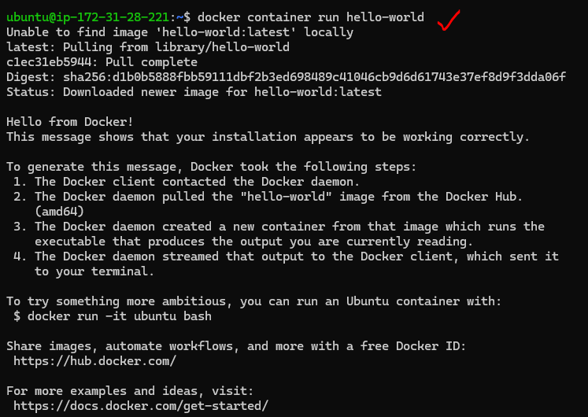

2. _**Windows 10/11 (Non Home editions)**_


    [ Refer Here : https://docs.docker.com/desktop/install/windows-install/ ]

* _**Note**_ : Installing docker on windows is not recommended

3. _**Mac**_

    [ Refer here : https://docs.docker.com/desktop/install/mac-install/ ]

#### Docker Playground

* Create a Docker Hub account 

    [ Refer Here : https://hub.docker.com/ ]

* This playground gives a linux machine with docker installed ( 4 hours for free ) 

    [ Refer Here : https://labs.play-with-docker.com/ ]

#### Terms to be aware of

* containerd
* runc
* libcontainer
* oci
* docker shim
* appc
* grpc
* rkt containers

 * Applications bring revenue to enterprises and to run applications we need servers, OS, etc

#### Let's create a linux server and install tomcat in it

* Create a linux server ( AWS / Azure / GCP ) 

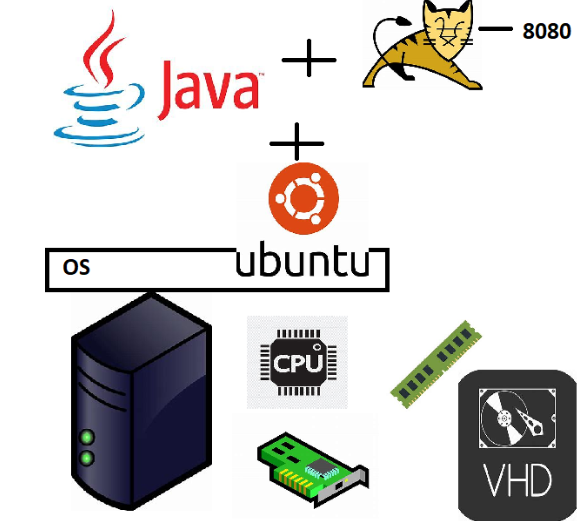

* We have experimented in the _**Linux VM ( Ubuntu )**_
    * network interface gives network connectivity
    * cpu, ram and disk are available
    * to install softwares we have used package manager `apt`
* Commands
```
htop
sudo apt update
sudo apt install net-tools -y
if config
sudo apt install openjdk-11-jdk -y
java -version
sudo apt-cache search tomcat
sudo apt install tomcat9 -y
sudo systemctl status tomcat9
```
* _**NOTE**_ :

+ to check network => `ifconfig`
+ to check java => `java -version`
+ to check tomcat => `sudo systemctl status tomcat9`

* We were able to exactly perform similar operations inside the container as well

#### Let me take a application

* This is spring petclinic application
* Let's try to run this application on linux ( ubuntu )

    [ Refer Here : https://github.com/spring-projects/spring-petclinic ]

* To build the code
```
sudo apt update
sudo apt install openjdk-17-jdk maven -y
git clone https://github.com/spring-projects/spring-petclinic.git
cd spring-petclinic/
# java package
mvn package
java -jar target/spring-petclinic-3.0.0-SNAPSHOT.jar
```
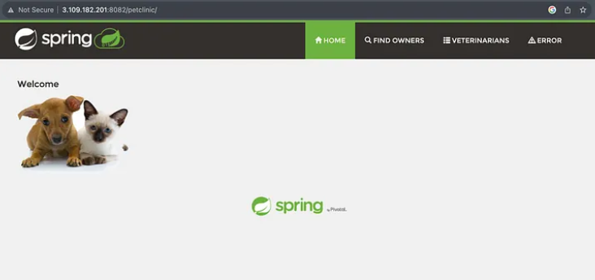

* Docker way of working
  * We create a _**Docker image (docker packaging format)**_
    * We need to create _**Dockerfile**_
    * Push the image to _**registry (docker hub, public registry)**_
    * Create the _**container**_ using the image anywhere

* Install docker on the VM using script and add to docker group
```
curl -fsSL https://get.docker.com -o get-docker.sh
sh get-docker.sh
sudo usermod -aG docker ubuntu
exit
relogin
cd spring-petclinic/
```
* _**Dockerfile**_ for spring pet clinic
```
FROM amazoncorretto:17-alpine-jdk
LABEL author=Harika
ADD target/spring-petclinic-3.0.0-SNAPSHOT.jar /springpetclinic.jar
EXPOSE 8080
CMD ["java", "-jar", "/springpetclinic.jar"]
```
* Add the Dockerfile and create docker image
```
vi Dockerfile
docker image build -t spc:1.0 .
```
* To create container at the original port `-P`
```
docker container run -d -P spc:1.0
```
* To create container at the different ports `-p` ( remember to allow open the required ports )
```
docker container run -d -p 8081:8080 spc:1.0
docker container run -d -p 8082:8080 spc:1.0
docker container run -d -p 8083:8080 spc:1.0
```
* Expose over the browser with the desired port
 
#### How Isolations are created ? ( OR ) How Containers Work ?

* Each container is getting a
    * new process tree
    * disk mounts
    * network (nic)
    * cpu/memory
    * users


* Docker Internals

    [ Refre here : https://directdevops.blog/2019/01/31/docker-internals/ ]

    + _**Container**_ : Isolation with some resource limits
    + Isolations are created using Linux kernel feature called _**Namespaces**_
    + The resource limits are applied by kernel feature called _**Cgroups / Control groups**_

    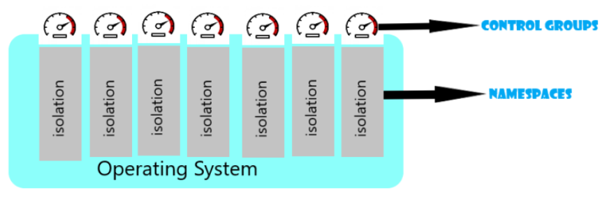

    + Docker engine makes it easy to create isolated areas and resource limits

    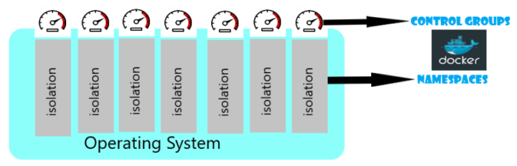

### Docker Architecture

#### _**Generation 1 :**_

* This was first gen, Where docker daemon used lxc (a linux kernel feature) to create containers

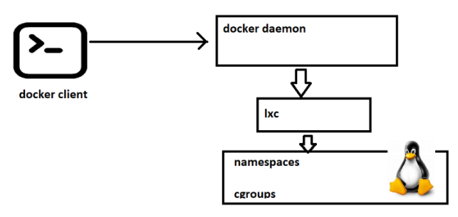

#### _**Generation 2 :**_

* Since docker was relying on lxc which was a kernel feature, updates to kernel frequently which used to break containers created by docker
* So docker has created it's own component called #### _**libcontainer (libc)**_ to create containers
* Docker wanted containers to be multi os and lxc was definetly not the way forward

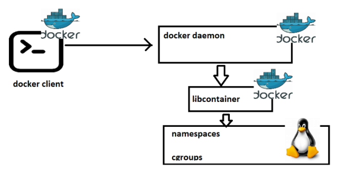

* Adoption of docker was drastically increased as it was stable

_**Generation 3 :**_

* In this generation, docker engine was revamped from monolith to multi component architecture and the images and containers were according to OCI (open container initiative), image spec and runtime spec
* In the latest architecture
* `Docker daemon` exposes api’s to listen requests from `Docker client`
* Passes the requests to `containerd`. This manages the lifecylcle of container
* containerd forks a _**runc process**_ which creates container. once the container is created the parent of the container will be `Docker shim`


#### Creating our first docker container

 _**Docker container creation :**_

* To create container we need some image in this case let's take `hello-world`
* The command `docker container run hello-world` executed
* What happens
    * `Docker client` will forward the request to Docker daemon
    * `Docker daemon` will check if the image exists locally. If yes it creates the container by using the image
    * If the image doesnot exist, then docker daemon tries to download the image from docker registry connected. The default _**Docker registry**_ is `Docker hub`
    * Downloading image into local repo from registy is called as `pull`
    * Once the image is pulled the container is created


* Registry is a collection of docker images hosted for reuse
* _**Docker hub**_ 

    [ Refer Here : https://hub.docker.com/search?q= ]

#### Playing with containers

* Create a new linux vm and install docker in it


* Open all ports
    * AWS

 


#### Check docker images in the host


#### Pull the images from docker hub

* image naming convention
```
[username]/[repository]:[<tag>]
shaikkhajaibrahim/myspc:1.0.1
username => shaikkhajaibrahi
repository => what image => myspc
tag => version => 1.0.1
```

* default tag is latest 
```
nginx
nginx:latest
```

* Official images don't have username
```
nginx
ubuntu
alpine
shaikkhajaibrahim/myspc
```

* Lets pull the image nginx with tag 1.23
```
docker image pull nginx:1.23
docker image ls
```


* Let's pull the jenkins image with latest version


* Let's find the alpine and pull the image


#### Remove images from local

* Every image will have unique image id and image name
* We can delete individually `docker image rm alpine:3.17`
* if I have to delete all the images `docker image rm $(docker image ls -q)`


#### Create a container with nginx

* To create and start the container we use run command


* _**note:**_ i will be using -d for some time and we will discuss importance of this in next session
* every container gets an id and a name. name can be passed while creating container, if not docker will give random name


* Remove all the running containers `docker container rm -f $(docker container ls -q )`


* Remove specific container


* Remove all containers `docker container rm -f $(docker container ls -a -q )`


* _**Exercise:**_ Start and stop containers


### Docker container lifecycle

* Docker lifecycle states :
 1. Created
 2. Running
 3. Paused
 4. Stopped
 5. Deleted


#### Accessing the applications inside docker containers

* From now the machine where we have installed docker will referred as `host` and the docker container will be referred as `container`
* We have access to host network & as of now containers are created in private container network, so to access applications inside containers we use `port-forwording`


* _**Command**_ : `docker container run -d -p <host-port>:<container-port> <image>`
* Create a _**nginx container**_ and expose on _**port 30000**_ we use , `docker container run -d -p 30000:80 --name nginx1 nginx`


* Create a _**jenkins container**_ & _**expose 8080 port on 30001**_ of host we use , `docker container run -d -p 30001:8080 --name jenkins1 jenkins/jenkins`


* To assing any random free port on host to container port `docker container run -d -P image`
* Let's create three nginx containers


#### Exercise

1. Install docker on a linux vm
2. Run 1 httpd containers (apache container) which runs on 80 port
3. try accessing any application
4. stop the containers
5. try accessing
6. start the continers and access this should work
7. pause the containers, access the application
8. unpause the containers, access the application
9. delete the container

#### Containerizing spring petclinic

* I have spring petclinic version 2.4.2 which requires java 11 and runs on port 8080
* To start the application `java -jar spring-petclinic-2.4.2.jar`
* What is required:
    + jdk 11
    + jar file
* How to access the application
    + http over port 8080
* Let's start the amazoncorretoo based container with port 8080 exposed 

    [ Refer Here : https://hub.docker.com/_/amazoncorretto ]

```
docker container run -it -p 30000:8080 amazoncorretto:11 /bin/bash
```


* now lets download the spring petclinic 

[ Refer Here : ]


*  Run the application `java -jar spring-petclinic-2.4.2.jar`


*  Now to create a image from a running container, lets login into linux vm, so let's use `docker container commit`


* remove all the containers and run the myspc image based container
```
docker container run -d -p 30001:8080 --name spc1 myspc:latest java -jar spring-petclinic-2.4.2.jar
```
* This is not a useful approach as we are creating images manually
* Docker has a better way i.e. _**Dockerfile**_

### Dockerfile based Image building

* Workflow


* Dockerfile is a text file with instructions Refer Here
* The basic syntax `INSTRUCTION arguments`
* In Docker we have concept of base image i.e. to run your application using some existing image
* We can use a base image called as scratch which has nothing in it
* In majority of the cases we take what is required to run our application as base image

#### Basic instructions to write a Dockerfile

* _**FROM**_ : use tag all the time (donot use latest)

    [ Refer Here : https://docs.docker.com/reference/dockerfile/#from ]

* _**RUN**_ : The commands to be executed while building the image to install/configure your appliation 

    [ Refer Here : https://docs.docker.com/reference/dockerfile/#run ]

* _**CMD**_ : This command will be executed while starting the container

    [ Refer Here : https://docs.docker.com/reference/dockerfile/#cmd ]

* _**EXPOSE**_ : This adds ports to be exposed while starting the container 

    [ Refer Here : https://docs.docker.com/reference/dockerfile/#expose ]

#### Spring petclinic Dockerfile

* Let's do two ways
 1. use any image with java11 already as base image `amazoncorretto:11`
 2. use any image with slim os as base image `alpine:3`

* Dockerfile- based on amazoncorreto:11 
```
FROM amazoncorretto:11
RUN curl https://referenceapplicationskhaja.s3.us-west-2.amazonaws.com/spring-petclinic-2.4.2.jar -o spring-petclinic-2.4.2.jar
EXPOSE 8080
CMD ["java", "-jar", "spring-petclinic-2.4.2.jar"]
```
* Let
s build the image based on amazoncorreto


* Now let's create a container `docker container run -d -P --name spc1 myspc:corretto11`


* Approach 2: Start from some os
```
FROM alpine:3
RUN apk add openjdk11
RUN wget https://referenceapplicationskhaja.s3.us-west-2.amazonaws.com/spring-petclinic-2.4.2.jar
EXPOSE 8080
CMD ["java", "-jar", "spring-petclinic-2.4.2.jar"]
```
* Build the image


* Let's run the container `docker container run -d -P --name myspc2 myspc:alpine`


### Immutable Infrastructure

* Any infra changes will not be done on infra directly rather we create some infra as code option and change the configuration

### Additional instructions for Dockerfile

 1. _**LABEL**_ : This instruction adds metadata


    [ Refer Here : https://docs.docker.com/reference/dockerfile/#label ]

    + Refer Here for the changes done for spc image
    + Let's inspect the image `docker image inspect spc:1.0.0.1` and observe the labels section


 2. _**ADD , COPY**_ : 

* ADD instruction can add the files into docker image from local file system as well as from http(s)
* ADD instruction can have sources
    + local file system
    + git repo
    + url
* COPY supports only local file system
* Let's use ADD to download springpetclinic into docker image from url `ADD https://referenceapplicationskhaja.s3.us-west-2.amazonaws.com/spring-petclinic-2.4.2.jar /spring-petclinic-2.4.2.jar`

* For the changes

    [ Refer Here : https://github.com/asquarezone/DockerZone/commit/6800c2af1ee665f335cd6e250848e95a0611b976 ]

* copy the springpetclinic jar file into some local path on docker host. For the changes 

    [ Refer Here : https://github.com/asquarezone/DockerZone/commit/d7e1e440f0151ef0b10a2ba01af11a8fed3ec199 ]

#### What do we mean by running container in detached mode ?

* Let's try to start the docker container jenkins `jenkins/jenkins`


* docker container’s STDOUT and STDERR will be attached to your terminal and if we execute ctrl+c the container exits
* Running container normally will take us to attached mode
* In detached mode container executes and gives us back the access to terminal


* Once we start the container in detached mode we can still view the STDOUT and STDERR by executing `docker container attach <container-name-or-id>`
* To exit from attach mode `Ctrl+PQ`

#### Docker container will be in running state as long as command in cmd is running

* Consider the following _**Dockerfile**_
```
FROM amazoncorretto:11
LABEL author="shaikkhajaibrahim"
LABEL organization="qt"
LABEL project="learning"
# Copy from local file on Docker host into docker image
COPY spring-petclinic-2.4.2.jar  /spring-petclinic-2.4.2.jar
EXPOSE 8080
CMD ["sleep", "10s"]
```
* We have sleep 10s i.e. this will run for 10s and finish
* Docker container will move to exited stated once the command in CMD has finished executing


#### Exercise:

* Create a ubuntu vm
* install apache2 and note the ExecStart command for apache2
* install tomcat9 and note the ExecStart command for tomcat9
* stop the services (systemcl stop servicename)
* become a root user (sudo -i)
* try executing the ExecStart command directly and see if the application is running

#### .net application manual process

* For manual steps

    [ Refer Here : https://docs.nopcommerce.com/en/installation-and-upgrading/installing-nopcommerce/installing-on-linux.html ]

* This  application requires
    + mysql  server (lets ignore this)
    + . dotnet runtime 7.0
    + it runs on port 5000
* Steps:
    + Ensure  dotnet 7 is installed
    + Download  application from Refer Here
    + unzip the application into some folder
    + create two directories bin and logs
    + Run the application using command `dotnet --urls "http://0.0.0.0:5000" Nop.Web.dll`

* We have created the following `Dockerfile`
```
FROM mcr.microsoft.com/dotnet/sdk:7.0
LABEL author="khaja" organization="qt" project="learning"
ADD https://github.com/nopSolutions/nopCommerce/releases/download/release-4.60.2/nopCommerce_4.60.2_NoSource_linux_x64.zip /nop/nopCommerce_4.60.2_NoSource_linux_x64.zip
WORKDIR /nop
RUN apt update && apt install unzip -y && \
    unzip /nop/nopCommerce_4.60.2_NoSource_linux_x64.zip && \
    mkdir /nop/bin && mkdir /nop/logs
EXPOSE 5000
CMD [ "dotnet", "--urls", "http://0.0.0.0:5000", "Nop.Web.dll" ]
```
* This is not working


* Try fixing
* Try using alpine version of dotnet 7 for the same application

#### Dockerfile instructions

 1. _**WORKDIR**_ : This instruction sets the working directory 
 
    [ Refer Here : https://docs.docker.com/reference/dockerfile/#workdir ]

#### Fixing issue with startup of .net application

* For the Dockerfile

    [ Refer Here : https://github.com/asquarezone/DockerZone/commit/14555855fddd6adb5da3d07c1833e09b5639f438 ]


* The document to host the .net application on `0.0.0.0`

    [ Refer here : https://andrewlock.net/5-ways-to-set-the-urls-for-an-aspnetcore-app/ ]

#### Setting Environment Variables in the container

* ENV instruction 

    [ Refer Here : https://docs.docker.com/reference/dockerfile/#env ]

* This instruction adds environmental variable in the container and it also allows us to change environmental variables while creating containers
* For the changes done to include environmental varibles

    [ Refer Here : https://github.com/asquarezone/DockerZone/commit/07243fd3a974b947c407f12570a9979cbc592025 ]

* docker container exec will allow us to execute commands in the container


* `docker container exec -it <c-name> <shell>` will allow us to login into container


* ARG instruction allows us to set the values while building the image 

    [ Refer Here : https://docs.docker.com/reference/dockerfile/#arg ]

* For the BUILD ARGS added

    [ Refer Here : https://github.com/asquarezone/DockerZone/commit/60a624985b34fe5b9a82c3fa87204738fd139cd8 ]

* Build args can be set while creating images. BUILD ARG can be used by using `${ARG_NAME}`
* We have build two images by changing the HOME_DIR and DOWNLOAD_URL Build args
```
docker image build --build-arg DOWNLOAD_URL=nopCommerce_4.60.2_NoSource_linux_x64.zip -t nop:1.0.2 .
docker image build --build-arg HOME_DIR=/publish -t nop:1.0.0 . 
```
* USER: 

    [ Refer Here : https://docs.docker.com/reference/dockerfile/#user ]

* For the changes done to add a non root user to run the nop commerce application

    [ Refer Here : https://github.com/asquarezone/DockerZone/commit/9e69fbecc61c60df83697c69d03867e4679a976d ]


#### Exercise:

* Game-of-life application:
    + This requires java 8
    + this requires tomcat 8 or 9
    + copy the gameoflife.war application into webapps folder of tomcat Refer Here
    + This runs on port 8080

### Image Layers

* A _**read-write layer**_ gets added to every container and image will have read layers

### Layers in Docker Image

* Let's pull alpine image and inspect the image
```
docker image pull alpine
docker image inspect alpine
```


#### Experiment 1

* Let's create a new image based on alpine exp1
```
FROM alpine
label author=khaja
CMD ["sleep", "1d"]
```
* list images


* inspect layers of alpine and exp1


* both have same layers

#### Experiment 2

* Let's create a new image based on alpine exp2
```
FROM alpine
label author=khaja
ADD 1.txt /
CMD ["sleep", "1d"]
```
* let's inspect layers of exp2 and alpine


#### Experiment 3

* Let's create a new image based on alpine exp3
```
FROM alpine
label author=khaja
RUN echo "one" > 1.txt
RUN echo "two" > 2.txt
RUN echo "three" > 3.txt
CMD ["sleep", "1d"]
```
* Inspect image layers


#### Experimenet 4

* Let's create a new image based on alpine exp4
```
FROM alpine
label author=khaja
RUN echo "one" > 1.txt && \
    echo "two" > 2.txt && \
    echo "three" > 3.txt
CMD ["sleep", "1d"]
```
* inspect results


* Docker image is collection of layers and some metadata
* Docker image gets first set of layers from base image
* Any Additional changes w.r.t ADD/COPY creates extra layers
* Each RUN instruction which needs some storage creates layer
* It is recommended to use Multiple commands in RUN instruction rather than multiple RUN instructions as this leads to too many layers
* Docker has a filesystem which is aware of layers
    + overlay2

### Container and layers

* When a container gets created all the effective read-only image layers are mounted as disk to the container
* Docker creates a thin read write layer for each container.
* Any changes made by container will be stored in this layer
* Problem: when we delete container read write layer will be deleted.
* For the article on layers

    [ Refer Here : https://directdevops.blog/2019/09/26/docker-image-creation-and-docker-image-layers/ ]
* For layers and storage Drivers

    [ Refer Here : https://directdevops.blog/2019/09/27/impact-of-image-layers-on-docker-containers-storage-drivers/#google_vignette ]

### Stateful Appplications and Stateless Applications
* Stateful applications use local storage to store any state
* Stateless applications use external systems (database, blobstorage etc) to store the state
* We need not do anything special if your application is stateless in terms of writable layer, but if it stateful we need to preserve the state

#### Solving the Problem with Writable Layers

* Let's create a mysql container Refer Here
* Command
```
docker container run -d --name mysqldb -e MYSQL_ROOT_PASSWORD=rootroot -e MYSQL_DATABASE=employees -e MYSQL_USER=qtdevops -e MYSQL_PASSWORD=rootroot -P mysql:8
```
* To login into container
```
docker container exec -it mysqldb mysql --password=rootroot
```
* To create a table
```
use employees;
CREATE TABLE Persons (
    PersonID int,
    LastName varchar(255),
    FirstName varchar(255),
    Address varchar(255),
    City varchar(255)
);
Insert into Persons Values (1,'test','test', 'test', 'test');
Select * from Persons;
```


* Now if we remove the container we loose the data
* To fix the problem with data losses, Docker has volumes
* Volume can exist even after docker container is deleted.
* We can attach volumes to other containers as well
* For this volume to work, we need to know the folder of which data will be preserved
* Let explore docker volume subcommand


* docker volume creates a storage according to the driver specified. The default driver is local i.e. the volume is created in the machine where docker is executing

### Docker Volumes

* For docker volumes blog

    [ Refer Here : https://directdevops.blog/2019/10/03/docker-volumes/ ]

#### Experiments

* Create a mysql container
* create a postgresql container
* list all the volumes
* inspect all the volumes
* create volume `docker volume create myvol`
* inspect myvol
* Figure out locations of volumes in your local systems

#### KeyPoints

 1. Always ensure volumes are automatically created for the stateful applications as part of Dockerfile (VOLUME instruction)
 2. Volumes are of two types
    + Explicity created (docker volume create myvol)
    + automatically created as part of container creation
 3. Ensure we have knowledge on necessary folders where the data is stored and use volumes for it

 ### Persisting Data using Volumes

 * Let's create an explicit volume for mysqldb
* Let's use volume type to mount the mysqldb
* Let's mount a volume using -v, for official docs

    [ Refer Here : https://docs.docker.com/storage/volumes/#start-a-container-with-a-volume ]
* Create a mysql container
```
 docker container run -d --name mysqldb -v mysqldb:/var/lib/mysql -P -e MYSQL_ROOT_PASSWORD=rootroot -e MYSQL_DATABASE=employees -e MYSQL_USER=qtdevops -e MYSQL_PASSWORD=rootroot mysql
```


* Let's create some data


* now delete the container
* Now create a new container using mount
```
 docker container run -d --name mysqldb --mount "source=mysqldb,target=/var/lib/mysql,type=volume" -P -e MYSQL_ROOT_PASSWORD=rootroot -e MYSQL_DATABASE=employees -e MYSQL_USER=qtdevops -e MYSQL_PASSWORD=rootroot mysql
 ```

 * As we can see the data is persisted and is attached to new container
    + Let's use bindmount to mount /tmp on docker host to the container /tmp
```
docker container run -d --name exp1 -v /tmp:/tmp ubuntu:22.04 sleep 1d

docker container run -d --name exp1 --mount "source=/tmp,target=/tmp,type=bind" ubuntu:22.04 sleep 1d
```
* Login into container and create some data


* check the content in /tmp of docker host


### Creating volume as part of Dockerfile

* Game-of-life
* For the changeset with volume instruction for gameoflife container

    [ Refer Here : https://github.com/asquarezone/DockerZone/commit/f58812733781b7ebed7b2a8d0b0584fe0338c4e6 ]


#### Shell file to clean everything

* Create a shell file with following content
```
#!/bin/bash
docker container rm -f $(docker container ls -a -q)
docker volume prune
docker image rm -f $(docker image ls -q)
```
#### Entrypoint and CMD

* Let's create two docker images
* First
```
FROM alpine
CMD ["sleep", "1d"]
```
* Create a container with `docker container run first ping -c 4 google.com`


* Second
```
FROM alpine
ENTRYPOINT ["sleep"]
CMD ["1d"]
```


#### Experiment

* Create a alpine container with the following names
```
docker container run -d --name C1 alpine sleep 1d
docker container run -d --name C2 alpine sleep 1d
```
* Now run in C1 `ping C2` (`docker container exec C1 ping C2`)
* Findout ip addresses of C1 container and C2 container by executing
```
docker container inspect C1
docker container inspect C2
```
* Now login into C1 and ping C2 by using its ipaddress
* Observation Results
    + ping by name is not working
    + ping by ip is working


* Create an ubunutu linux vm
* install net-tools
```
sudo apt update && sudo apt install net-tools -y
ifconfig
```


* Now install docker and check network interfaces again `ifconfig`


* A docker0 network interface is added

### Docker Networks

* For the article on docker networking

    [ Refer Here : https://directdevops.blog/2019/10/05/docker-networking-series-i/ ]

* Docker has multiple network driver implementations
    + bridge
    + host
    + macvlan
    + overlay
* _**Bridge**_:
    + Default bridge will not have dns enabled (this is why in the above experiment C1 was not able to ping C2 by name)
* Create a container C1 in default network `docker container run -d --name C1 alpine sleep 1d`
* inspect default bridge network `docker network inspect bridge`


* Let's create a new bridge network


* Now create two contianers C2 and C3 in my_bridge network


* Inspect my_bridge network


* Let's try ping from c2 to c3 by name


* Let's create a mysql container in my_bridge network
```
 docker container run -d --name mysqldb -v mysqldb:/var/lib/mysql -P -e MYSQL_ROOT_PASSWORD=rootroot -e MYSQL_DATABASE=employees -e MYSQL_USER=qtdevops -e MYSQL_PASSWORD=rootroot --network my_bridge mysql
 ```
* Let's run _**phpmyadmin**_
```
docker container run --name phpmyadmin --network my_bridge -d -e PMA_HOST=mysqldb -P phpmyadmin
```


* Connect container C1 to my_bridge network
```
docker container exec C1 ip addr
docker network connect my_bridge C1
docker container exec C1 ip addr
docker network disconnect bridge C1
docker container exec C1 ip addr
```

### Multi Stage Docker build

* Multi staged build is used to build the code and copy necessary files into the final stage which will be your image


* For official docs

    [  Refer Here : https://docs.docker.com/build/building/multi-stage/ ]

#### Scenario – 1: Java Spring petclinic

* To build this application we need
    + jdk17
    + maven
    + git
* Manual steps:
```
git clone https://github.com/spring-projects/spring-petclinic.git
cd spring-petclinic 
mvn package
# a file gets created in target/spring-petclinic-*.jar
```
* To run this application we need jdk 17
* For the changes done to create spring petclinic as multistage build

    [ Refer Here : https://github.com/asquarezone/DockerZone/commit/968357bc0da234840996e75b3394811715bc35a9 ]

#### Scenario -2 Game of life

* code 

    [ Refer Here : https://github.com/wakaleo/game-of-life ]
* _**Tools**_ :
    + jdk 8
    + git
    + maven
* For the solution

    [ Refer Here : https://github.com/asquarezone/DockerZone/commit/b16d521e8a8d35471ffa918a7fcd6951f4d7fecd ]

### Pushing images to Registries

1. _**Public Registry : Docker Hub**_

    [ Refer Here : https://hub.docker.com/ ]

* Create a public Repository


* Repository will be in the form of `<username>/<repo-name>:<tag>`


* After building the image tag the image to new naming format
```
docker image tag spc:3.0.0 shaikhajaibrahim/qtspringpetclinic:3.0.0
```


* if this image has to be default also tag with latest (optional)
```
docker image tag spc:3.0.0 shaikhajaibrahim/qtspringpetclinic:latest
```


* login into docker hub from cli
```
docker login
```


* lets push the images


2. _**Private Registries**_

* There are many applciations for hosting private registries
    + _**AWS : ECR**_ (Elastic container registry)
    + _**Azure : ACR**_ ( Azure Container Registry)
    + _**Jfrog**_

### AWS ECR

* Create an ECR repository


* View push commands


* Install and configure aws cli

    [ Refer here : https://sst.dev/chapters/create-an-iam-user.html ]

* Follow as shown inclass


### Azure ACR

* For detailed info

    [ Refer here : https://learn.microsoft.com/en-us/azure/container-instances/container-instances-tutorial-prepare-acr ]

### Understanding Multi-Host Networking

* Multi-host networking is created as part of docker orchestration called as _**SWARM**_
* For multi host networking

    [ Refer Here : https://directdevops.blog/2019/10/07/docker-networking-series-ii-overlay-networks/ ]
* For swarm

    [ Refer Here : https://directdevops.blog/2019/10/07/docker-swarm-mode/ ]

* According to what we have learnt so far. Communication between containers in same host is possible using bridge or macvlan etc. but communication between two containers running on two different hosts is not possible


* Docker has a netwok driver called as overlay network
* Using vxlan, overlay networks use underlay to create a virtual network which is logical and appears as if the containers across hosts are connected to the same network


* To create multi host network, we need to create docker swarm cluster.

* Swarm cluster provides native docker container orchestration.
* Some of the activities the cluster performs
    + Maintains the desired state.
    + Performs scaling
    + chooses the master node (manager)
    + ability to add docker hosts to the cluster
* refer to classroom video for some executions on swarm

#### Exercise

* To execute the commands and understand

    [ Refer here : https://directdevops.blog/2019/10/07/docker-logging-docker-memory-cpu-restrictions/ ]

* For understanding yaml and json

    [ Refer here : https://www.youtube.com/watch?v=ggOmHlnhPaM&list=PLuVH8Jaq3mLud3sVDvJ-gJ__0zd15wGDd&index=15 ]

#### Sample application

* Python based application :
    + Web application
    + Database
* Code: 

    [ Refer Here : https://github.com/DevProjectsForDevOps/StudentCoursesRestAPI ]

* This application has a python web frontend.
* Create a image by following instructions 

    [ Refer Here : https://directdevops.blog/2019/11/02/deploying-the-docker-application-and-mysql-with-volume-support-into-kubernetes-from-code-to-docker-registries-like-acr-ecr-and-then-to-eks-aks/#google_vignette ]

* Create a mysql container according to docs
* get the mysql ip address and pass it as environment variable to the python web application
* What is that you need to do
    + Create a bridge network
    + Create a volume and attach it to mysql container
    + Resolve the mysql container by its name
* To do this
```
git clone https://github.com/DevProjectsForDevOps/StudentCoursesRestAPI.git
cd StudentCoursesRestAPI
docker image build -t scr:latest
docker network create -d bridge scr_bridge
docker volume create scr_db
docker container run -d --name mysql -e MYSQL_ROOT_PASSWORD=password -e MYSQL_DATABASE=test -e MYSQL_USER=directdevops -e MYSQL_PASSWORD=directdevops --network scr_bridge -v scr_db:/var/lib/mysql mysql:5.6
docker container run -d --name mypythonapp -e MYSQL_SERVER=mysql --network scr_bridge -P scr:latest
```

#### YAML

* This is data representation format,which uses name/value pairs
* The basic format is `<name>:<value>`
```
topic:Docker
```
* Types of data :
    + Simple/Scalar
        * Text
        * number
        * boolean
    + Complex
        * list/array
        * map/dictionary/object
* Extension of YAML files is .yaml or .yml. YAML is a text file
* Simple yaml
```
url: directdevops.blog
author: khaja
isDailyUpdated: true
isLoginRequired: false
articlecount: 1000
```
* List example
```
Colors:
  - Black
  - White
Movies:
  - Avengers
  - Batman Begins
```
* Map/Dictionary/Object
```
Address:
  flatno: 407
  building: Mythrivanam
  area: Ameerpet
  city: Hyderabad
```
* yaml about Quality Thought
```
name: QualityThought
url: https://qualitythought.in
courses:
  - name: Azure
    faculty: khaja
    duration: 90
  - name: AWS
    faculty: khaja
    duration: 90
  - name: DevOps
    faculty: khaja
    duration: 110
  - name: Manual Testing
    faculty: Ramana
    duration: 60
Branches:
  headoffice:
    flatno: 302
    building: nilgiri
    city: hyderabad
  devops:
    flatno: 407
    building: mythrivanam
    city: hyderabad
```
* Try writing about yourself in a yaml according to following structure
```
#qualification
yearofpassing: <number>
university: <text>
grade: text (A+|A|B|C)
----
# education
<name>: <qualification>

----
name: <text>
mobile: <text>
email: <text>
education: list(<education>)
```
* Example 1 (Postgraduate)
```
name: vishnu
mobile: '999999999'
email: vishnu@gmail.com
education:
  - mtech:
      yearofpassing: 2017
      university: jnu
      grade: A
  - btech:
      yearofpassing: 2015
      university: jntu
      grade: A+
```
* Example (graduate – BSc)
```
name: Swathi
mobile: '88888888'
email: swathi@outlook.com
education:
  - BSc:
      yearofpassing: 2020
      university: osmania
      grade: A+
```
* YAML will be used to define kuberentes manifests and docker compose files

### Docker compose

* This was external tool, but now it is integrated as docker subcommand `docker compose`
* Compose allows use to specify the yaml file which helps in creating the below by specifying in a yaml file
    + networks
    + volumes
    + containers
* docker compose file will have the name of docker-compose.yml
* sample
```
version: '3.9'
services:
  web:
    image: nginx:latest
    networks:
      - hello-net
    volumes:
      - type: volume
        source: my-vol
        target: /tools
networks:
  hello-net:
    driver: bridge
volumes:
  my-vol:
```
* to start all the containers create a folder copy the docker-compose.yaml and execute `docker compose up -d` and to remove every thing `docker compose down`


* For the compose file with instructions to run student course register which we have executed manually yesterday

    [ Refer Here : https://github.com/DevProjectsForDevOps/StudentCoursesRestAPI/blob/master/docker-compose.yaml ]

#### Activity

* Containerize nop commerce


* Run these using commands
* create a docker compose file
* let's create nop-net bridge network
```
docker network create --driver bridge nop-net
```
* Let's create a nop-db volume
```
docker volume create nop-db
```
* Let's start by creating mysql container
```
docker container run --name mysql --network nop-net -d \
    -e MYSQL_ROOT_PASSWORD=rootroot \
    -e MYSQL_USER=nop \
    -e MYSQL_PASSWORD=rootroot \
    -v nop-db:/var/lib/mysql \
    mysql:8
```
* Now build the nop image using Dockerfile
```
FROM mcr.microsoft.com/dotnet/sdk:7.0
LABEL author="khaja" organization="qt" project="learning"
ARG user=nopcommerce
ARG group=nopcommerce
ARG uid=1000
ARG gid=1000
ARG DOWNLOAD_URL=https://github.com/nopSolutions/nopCommerce/releases/download/release-4.60.2/nopCommerce_4.60.2_NoSource_linux_x64.zip
ARG HOME_DIR=/nop
RUN apt update && apt install unzip -y
# Create user nopcommerce
RUN groupadd -g ${gid} ${group} \
    && useradd -d "$HOME_DIR" -u ${uid} -g ${gid} -m -s /bin/bash ${user}
USER ${user}
WORKDIR ${HOME_DIR}
ADD --chown=${user}:${group} ${DOWNLOAD_URL} ${HOME_DIR}/nopCommerce_4.60.2_NoSource_linux_x64.zip
RUN unzip ${HOME_DIR}/nopCommerce_4.60.2_NoSource_linux_x64.zip && \
    mkdir ${HOME_DIR}/bin && mkdir ${HOME_DIR}/logs
EXPOSE 5000
ENV ASPNETCORE_URLS="http://0.0.0.0:5000"
CMD [ "dotnet", "Nop.Web.dll"]
```
* Now run the nop container
```
docker container run --name nop --network nop-net \
    -P -d nop:4.60.2
```
* In the install page, pass connection string
```
server=mysql;uid=root;pwd=rootroot;database=nop
```
* Doing the same as above using compose file, for the changes

    [  Refer Here : https://github.com/asquarezone/DockerZone/commit/4b4427993cb3088e394f85a59acb2a52bc06c4c9 ]
